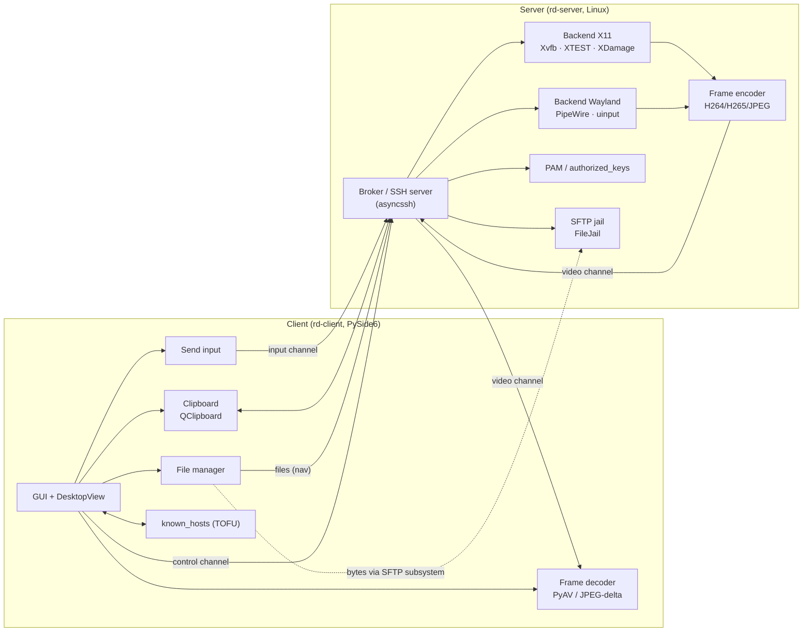

<div align="center">

# SSH Remote Desktop

**A remote desktop over SSH — for anyone who needs graphical access to a Linux machine without VNC, RDP, or extra open ports.**

[](https://github.com/hirokyserega-web/ssh-remote-desktop/actions/workflows/ci.yml)
[](https://github.com/hirokyserega-web/ssh-remote-desktop/actions/workflows/release.yml)
[](https://github.com/hirokyserega-web/ssh-remote-desktop/releases)
[](LICENSE)
[](https://www.python.org/)
[](#platform-support)

[**RU**](README.md) · **EN**

</div>

---


> The screenshots above are placeholders in `docs/img/`. Replace `client.png` and `server-gui.png` with real shots of `rd-client` and `rd-server-gui` (see `docs/img/README.md`).

---

## Key features

- 🔐 **SSH-only transport.** No VNC/RDP/open graphical ports — everything is multiplexed over a single SSH connection (channels `control` / `video` / `input` / `clipboard` / `files`).
- 🖥️ **Server on X11 and Wayland.** X11 — via Xvfb + XTEST + XDamage + XFixes. Wayland — via PipeWire + `xdg-desktop-portal` + wlr protocols + `uinput` (Wayland screen capture is experimental — see [platforms](#platform-support)).
- 🎞️ **Codecs `h264` / `h265` / `jpeg`.** H.264/H.265 via PyAV (ffmpeg), JPEG via Pillow with delta encoding by dirty rectangles. Auto-fallback to JPEG when PyAV is unavailable.
- 📁 **SFTP with jail.** Byte transfer uses the stock asyncssh SFTP subsystem, but navigation is confined to the session's shared directory (`FileJail` rejects `..` and absolute paths).
- 📋 **Clipboard.** Bidirectional sync via `xclip`/`wl-clipboard` on the server and `QClipboard` on the client. Size limit and per-side disable in config.
- 👥 **Multi-session.** Several simultaneous sessions on one server, persistent sessions for reconnect, idle-timeout, `max_sessions` limit.
- 🛠️ **Daemon and systemd.** `rd-server --daemon/--stop/--status` (double-fork + setsid + pidfile), or `--install-service` / `--uninstall-service` for the `ssh-remote-desktop.service` systemd unit.
- 🎛️ **`rd-server-gui` control panel.** Edits `server.toml`, starts/stops/restarts the server (via systemd or daemon fallback), live log, tray, autostart-at-boot toggle. No secrets stored.

## Contents

- [Quick start](#quick-start)
- [Platform support](#platform-support)
- [Architecture](#architecture)
- [Installation (detailed)](#installation-detailed)
- [Running the server](#running-the-server)
- [Running the client](#running-the-client)
- [SSH keys](#ssh-keys)
- [Clipboard](#clipboard)
- [Files and SFTP](#files-and-sftp)
- [Multi-session](#multi-session)
- [Configuration](#configuration)
- [Building binaries](#building-binaries)
- [Troubleshooting](#troubleshooting)
- [Security](#security)
- [Development & contributing](#development--contributing)
- [License](#license)

## Quick start

Install the client and server with one command. By default a prebuilt binary from the latest [GitHub Release](https://github.com/hirokyserega-web/ssh-remote-desktop/releases) is installed (with SHA256 verification); if no asset for your platform exists — it builds from source.

**Linux — server** (needs `sudo` for PAM, Xvfb and `/dev/uinput`):

```bash
curl -fsSL https://raw.githubusercontent.com/hirokyserega-web/ssh-remote-desktop/main/scripts/install-server-linux.sh | sudo bash
```

Installs the `rd-server` daemon and the `rd-server-gui` control panel (appears in the app menu as "SSH Remote Desktop — Server Panel"), verifies SHA256, and symlinks the binaries into `~/.local/bin`.

**Linux — client:**

```bash
curl -fsSL https://raw.githubusercontent.com/hirokyserega-web/ssh-remote-desktop/main/scripts/install-client-linux.sh | bash
```

**Windows — client** (PowerShell 5.1+):

```powershell
iwr -useb https://raw.githubusercontent.com/hirokyserega-web/ssh-remote-desktop/main/scripts/install-client-windows.ps1 | iex
```

**First run (3 steps):**

```bash
# 1. On the client: generate an SSH key (or use an existing ~/.ssh/id_ed25519)
rd-client --keygen                # on the client machine

# 2. Add the client's public key to the server user's authorized_keys
#    (paste ~/.config/ssh-remote-desktop/id_ed25519.pub into
#     server_user@server:~/.ssh/authorized_keys)

# 3. Connect
rd-client --host YOUR-SERVER --user YOUR-USER --key-path ~/.ssh/id_ed25519
```

> Binaries land in `~/.local/share/ssh-remote-desktop/bin` and are symlinked from `~/.local/bin`. If `~/.local/bin` is not on your `PATH`, open a new shell or run `export PATH="$HOME/.local/bin:$PATH"`.

## Platform support

| Component | Linux X11 | Linux Wayland | Windows | macOS |
|---|:---:|:---:|:---:|:---:|
| **Server** (screen capture + input) | ✅ Full (Xvfb + XTEST + XDamage) | ⚠️ Experimental (PipeWire + portal; placeholder frame if the portal is unavailable) | ❌ | ❌ |
| **Client** (GUI + decoder) | ✅ (`xcb`) | ✅ (`wayland;xcb` with XWayland fallback) | ✅ | ⚠️ Build from source, no prebuilt release asset |

The server backend is selected via `backend = "auto" | "x11" | "wayland"` (default `auto`: X11 if `DISPLAY` is present, else Wayland).

## Architecture



**One SSH channel, five logical channels.** The asyncssh transport gives us a single byte stream; on top of it `common/framing.py` runs a mini-multiplexer: every frame is tagged with a `Channel` (`control` / `video` / `input` / `clipboard` / `files`) in a fixed 6-byte header (`common/protocol.py`). Control-plane messages are serialized with MessagePack when available, otherwise JSON (`common/messages.py`).

**Files are a hybrid.** File bytes travel over the stock asyncssh SFTP subsystem (a separate SSH channel), while the `files` channel in our multiplexer carries only navigation/status commands. `FileJail` (`server/files.py`) confines every path to the session's shared directory.

<details>
<summary><strong>Repository layout</strong></summary>

```
client/            PySide6 GUI client: main_window, desktop_view, transport, decoder, dialogs
common/            Shared code for both sides
  protocol.py      PROTO_VERSION, Channel, Flags, frame layout
  framing.py       Frame codec + async multiplexer
  messages.py      Serialization of control/input/clipboard messages (JSON/MessagePack)
  config.py        ServerConfig / ClientConfig, TOML/JSON loading
server/            SSH server
  broker.py        Broker: accept connections, SFTP factory, dispatch
  connection.py    Per-SSH-session handling
  daemon.py        Double-fork, pidfile, --stop/--status
  encoder.py       H264/H265/JPEG encoders
  backend/         base.py · x11.py · wayland.py · wayland_pipewire.py
  files.py         FileJail (SFTP jail)
  auth.py          PAM / authorized_keys
server_gui/        rd-server-gui: PySide6 server control panel
  controller.py    Qt-free testable logic (ConfigController, ServiceController)
  __main__.py      GUI window + tray
crypto/            keygen.py — ed25519 key generation
scripts/           install.sh · install.ps1 · install-{client,server}-linux.sh · install-client-windows.ps1 · release.sh
packaging/systemd/ ssh-remote-desktop.service — unit template
tests/             pytest + pytest-asyncio
build_*.sh         Standalone binary builds via Nuitka
```

</details>

## Installation (detailed)

<details>
<summary><strong>Universal installer <code>scripts/install.sh</code></strong></summary>

By default installs a prebuilt binary from the latest release (with SHA256 verification from `SHA256SUMS`). If no asset for your platform exists — builds from source.

```bash
curl -fsSL https://raw.githubusercontent.com/hirokyserega-web/ssh-remote-desktop/main/scripts/install.sh | bash
```

**Flags:**

| Flag | Description |
|---|---|
| `--run` | Install a stable release (default) |
| `--dev` | Git clone + editable `pip install -e .` |
| `--both` | Dev checkout + build a binary |
| `--build` | Force a Nuitka build |
| `--no-build` | Skip building binaries |
| `--from-source` | Always from source, ignore releases |
| `--version X.Y.Z` | A specific release |
| `--component client\|server\|both` | What to install (default: `both` on Linux, `client` elsewhere). `server` on Linux installs the `rd-server` daemon AND the `rd-server-gui` panel; pass `server-gui` to install the panel only |
| `--dir PATH` | Install directory |
| `--python BIN` | A specific interpreter |
| `--uninstall` | Fully remove (binary, venv, symlinks, empty config) |
| `-h, --help` | Help |

**Environment variable:** `SSH_REMOTE_DESKTOP_DIR` — install directory (default `~/.local/share/ssh-remote-desktop`; for the server wrapper script — `/opt/ssh-remote-desktop`).

</details>

<details>
<summary><strong>Manual install via pip extras</strong></summary>

```bash
git clone https://github.com/hirokyserega-web/ssh-remote-desktop.git
cd ssh-remote-desktop
python -m venv .venv && source .venv/bin/activate
pip install -e .
```

**Extras** (from `pyproject.toml`):

```bash
# Client on any OS
pip install "ssh-remote-desktop[client]"

# Server on Linux (X11)
pip install "ssh-remote-desktop[server,server-x11]"

# Server on Linux (Wayland)
pip install "ssh-remote-desktop[server,server-wayland]"

# Server GUI panel
pip install "ssh-remote-desktop[server-gui]"

# H.264/H.265 — needs PyAV (ffmpeg)
pip install "ssh-remote-desktop[h264]"

# JPEG-only — Pillow is enough
pip install "ssh-remote-desktop[jpeg]"

# Everything for a Linux host running both client and server
pip install "ssh-remote-desktop[linux-full]"

# Development: pytest + pytest-asyncio + ruff
pip install "ssh-remote-desktop[dev]"
```

**Linux system packages** are installed automatically by `install.sh`. For manual install see the comments in `scripts/install.sh` (the `install_system_deps` section): for Debian/Ubuntu that's `xvfb xauth xclip ffmpeg qt6-wayland libxcb-* libdbus-1-3 openssh-server`, etc.

</details>

## Running the server

<details>
<summary><strong>Foreground (default, also under systemd)</strong></summary>

```bash
rd-server --config /etc/ssh-remote-desktop/server.toml
# or with CLI overrides
rd-server --host 0.0.0.0 --port 2222 --backend auto --codec h264 --max-sessions 10
```

SIGTERM/SIGINT trigger a clean `Broker.shutdown()`. Default pidfile: `/run/ssh-remote-desktop.pid` (as root) or `~/.config/ssh-remote-desktop/rd-server.pid` (as a user); override with `--pidfile`.

</details>

<details>
<summary><strong>Daemon (<code>--daemon</code> / <code>--stop</code> / <code>--status</code>)</strong></summary>

```bash
# Run in the background (double-fork + setsid; stdio → --log-file or /dev/null)
rd-server --daemon --config /etc/ssh-remote-desktop/server.toml --log-file /var/log/rd-server.log

# Check status
rd-server --status
# → running | stopped, pid, port, host

# Stop (SIGTERM via pidfile)
rd-server --stop
```

The daemon refuses to start if a live PID is already recorded in the pidfile — run `--stop` first. Implemented in `server/daemon.py`.

</details>

<details>
<summary><strong>systemd unit</strong></summary>

Unit template: `packaging/systemd/ssh-remote-desktop.service` (`Type=simple`, `User=root`, `Restart=on-failure`). The `rd-server` commands render the unit with the real binary path, write it to `/etc/systemd/system/`, run `daemon-reload`, and `enable --now`:

```bash
# Install and enable autostart
sudo rd-server --install-service --config /etc/ssh-remote-desktop/server.toml

# Only enable/disable autostart for an already-installed unit
sudo rd-server --enable-service
sudo rd-server --disable-service

# Fully remove: stop + disable + rm the unit + daemon-reload
sudo rd-server --uninstall-service
```

Once installed, manage the service the standard way:

```bash
sudo systemctl status ssh-remote-desktop.service
sudo journalctl -u ssh-remote-desktop.service -f
```

</details>

<details>
<summary><strong><code>rd-server-gui</code> control panel</strong></summary>

```bash
rd-server-gui                              # open the window with the default config path
rd-server-gui --config /etc/ssh-remote-desktop/server.toml
rd-server-gui --tray                       # enable the tray icon (default)
rd-server-gui --no-tray                    # no tray
rd-server-gui --minimized                  # start minimized to the tray
```

The panel (`server_gui/`) lets you:

- edit `server.toml` (host/port/backend/limits/codec/auth toggles/`run_as_user`/logging) with validation and atomic saving;
- start/stop/restart the server — via systemd if the unit is installed, else via `rd-server --daemon/--stop`;
- watch live status (running/stopped, PID, port) and the log tail (journald for systemd, `--log-file` for the daemon);
- toggle "Autostart at boot" (systemd only);
- minimize to the tray with a "Minimize to tray on close" preference.

The config controller lives in `server_gui/controller.py` and is tested without Qt. No secrets are written to config.

</details>

<details>
<summary><strong>Under X11 (Xvfb)</strong></summary>

The `x11` backend (`server/backend/x11.py`) uses `Xvfb` for a headless display, XTEST for input, XDamage + XFixes for incremental capture. Options in `server.toml`:

```toml
backend = "x11"
xvfb_bin = "Xvfb"               # path to the Xvfb binary
window_manager = ""             # optional per-session WM/DE command
session_geometry = [1920, 1080]
session_depth = 24
```

</details>

<details>
<summary><strong>Under Wayland (headless compositor)</strong></summary>

The `wayland` backend (`server/backend/wayland.py` + `wayland_pipewire.py`) uses `xdg-desktop-portal` + PipeWire for ScreenCast and `uinput`/`ydotool` for input. If the portal/daemon is unavailable, `capture()` returns a **placeholder frame**, while input and clipboard still work. This is intentional graceful degradation, not a production-ready capture path.

```toml
backend = "wayland"
wayland_compositor = "sway"     # sway | weston | kwin | gnome
use_uinput = true               # input emulation via /dev/uinput
```

</details>

## Running the client

<details>
<summary><strong>CLI and connection</strong></summary>

```bash
rd-client --host YOUR-SERVER --user YOUR-USER --key-path ~/.ssh/id_ed25519
rd-client --config ~/.config/ssh-remote-desktop/client.toml
rd-client --keygen                                # only generate a key, no GUI
```

**Flags** (`client/__main__.py`):

| Flag | Description |
|---|---|
| `--config PATH` | Path to `client.toml` |
| `--host`, `--port`, `--user` | Connection parameters |
| `--auth {key,password,agent}` | Authentication method |
| `--key-path PATH` | Path to the private key |
| `--codec {h264,h265,jpeg}` | Video codec |
| `--qt-platform {auto,xcb,wayland}` | Force a Qt plugin (Linux) |
| `--fullscreen` | Start fullscreen |
| `--no-clipboard` | Disable clipboard sync |
| `--keygen` | Only open the SSH key generator and exit |
| `--log-level` | Log level |

On Linux `QT_QPA_PLATFORM` is chosen automatically: when `WAYLAND_DISPLAY` is set — `wayland;xcb` (with XWayland fallback), otherwise `xcb`. HiDPI scaling is on by default.

</details>

<details>
<summary><strong>On Windows / Linux X11 / Linux Wayland</strong></summary>

- **Windows:** install via `install-client-windows.ps1` (see [Quick start](#quick-start)). Then `rd-client` in a new shell, or `rd-client --keygen` to generate a key.
- **Linux X11:** `rd-client` runs with `QT_QPA_PLATFORM=xcb`.
- **Linux Wayland:** `QT_QPA_PLATFORM=wayland;xcb` (native Wayland with XWayland fallback if the `wayland` Qt plugin is missing from the build). Wayland detection is multi-signal: `WAYLAND_DISPLAY` → `XDG_SESSION_TYPE=wayland` → a `wayland-N` socket in `XDG_RUNTIME_DIR`, and `XDG_RUNTIME_DIR` is recovered from `/run/user/<uid>` when missing from the environment.
- **Launching from the app menu (Wayland):** `.desktop` entries run the binary through the `rd-launch` wrapper, which restores the session variables (`WAYLAND_DISPLAY`, `XDG_RUNTIME_DIR`) that are absent from the D-Bus / `systemd --user` activation environment — otherwise on Hyprland/Sway/river/non-systemd GNOME clicking the menu entry silently opens nothing.
- **If the client still won't open:** crash details are written to `~/.config/ssh-remote-desktop/client-launch.log` (Qt platform, env vars, traceback) — attach it to an issue. A dialog with the log path is shown when possible.

</details>

## SSH keys

<details>
<summary><strong>Generation and distribution</strong></summary>

```bash
# In the client: Help → SSH keys (or the --keygen flag)
rd-client --keygen
# Creates an ed25519 key at ~/.config/ssh-remote-desktop/id_ed25519
```

Add the public key (`id_ed25519.pub`) to the server user's `~/.ssh/authorized_keys`. The server uses system accounts and PAM (`server/auth.py`); it does not create separate users.

Default client config:

```toml
auth = "key"
key_path = "~/.config/ssh-remote-desktop/id_ed25519"
known_hosts = "~/.config/ssh-remote-desktop/known_hosts"
accept_unknown_host = false     # false → TOFU prompt in the UI
```

`auth` may also be `"password"` or `"agent"` (use ssh-agent).

</details>

## Clipboard

<details>
<summary><strong>Bidirectional sync</strong></summary>

- **Server:** `xclip` under X11, `wl-clipboard` under Wayland.
- **Client:** `QClipboard` from PySide6.
- Carried over the `clipboard` channel of our multiplexer.

Toggles and limits are in the configs:

```toml
# server.toml
clipboard_enabled = true
clipboard_max_bytes = 1048576     # 1 MiB

# client.toml
clipboard_enabled = true
clipboard_max_bytes = 1048576
```

Client: `--no-clipboard` for a single run. Server: `--no-clipboard`.

</details>

## Files and SFTP

<details>
<summary><strong>SFTP jail and shared directory</strong></summary>

Byte transfer goes through the stock asyncssh SFTP subsystem, but `FileJail` (`server/files.py`) confines every path to the **session's shared directory**. Absolute paths and `..` traversal are rejected; the client never sees the server filesystem outside that directory. The `files` channel in our multiplexer carries only navigation/status commands.

```toml
# server.toml
files_enabled = true
shared_dir = "~/shared"           # relative to each user's HOME
sftp_chunk_size = 262144          # 256 KiB

# client.toml
files_enabled = true
local_shared_dir = "~/ssh-remote-desktop-shared"
```

In the GUI client, the file manager opens from the toolbar. Server: `--no-files` for a single run.

</details>

## Multi-session

<details>
<summary><strong>Session model</strong></summary>

```toml
# server.toml
max_sessions = 10                 # simultaneous session limit
idle_timeout = 600                # seconds; 0 disables
persistent_default = false        # keep-alive sessions for reconnect
session_geometry = [1920, 1080]
session_depth = 24
```

```toml
# client.toml
new_session = true                # request a new session
persistent = false                # reconnect to an existing persistent session
auto_reconnect = true
reconnect_delay = 2.0
max_reconnect_attempts = 0        # 0 = infinite
```

`run_as_user = true` (default) — the server drops privileges to the connecting user after authentication.

</details>

## Configuration

<details>
<summary><strong>Config search paths</strong></summary>

Configuration is layered: defaults ← file (TOML/JSON) ← CLI args.

**Server** (`load_server_config`), first match wins:

1. `RD_SERVER_CONFIG` (env)
2. `./server.toml`
3. `~/.config/ssh-remote-desktop/server.toml`
4. `/etc/ssh-remote-desktop/server.toml`

**Client** (`load_client_config`):

1. `RD_CLIENT_CONFIG` (env)
2. `./client.toml`
3. `~/.config/ssh-remote-desktop/client.toml`

</details>

<details>
<summary><strong>Full <code>server.toml</code> with defaults</strong></summary>

```toml
# Network
host = "0.0.0.0"
port = 2222

# Server SSH host key (generated on first run if missing)
host_key = "~/.config/ssh-remote-desktop/host_ed25519"

# Backend: "auto" | "x11" | "wayland"
backend = "auto"

# Sessions
max_sessions = 10
idle_timeout = 600                # seconds; 0 disables
persistent_default = false
session_geometry = [1920, 1080]
session_depth = 24

# Encoding
codec = "h264"                    # h264 | h265 | jpeg (falls back to jpeg if PyAV missing)
fps = 30
bitrate_kbps = 6000
jpeg_quality = 80
cursor_mode = "embedded"          # "embedded" | "metadata"

# X11
xvfb_bin = "Xvfb"
window_manager = ""               # optional per-session WM/DE command

# Wayland
wayland_compositor = "sway"       # sway | weston | kwin | gnome
use_uinput = true

# Clipboard
clipboard_enabled = true
clipboard_max_bytes = 1048576     # 1 MiB

# Files / SFTP jail
files_enabled = true
shared_dir = "~/shared"           # relative to each user's HOME
sftp_chunk_size = 262144          # 256 KiB

# Auth
allow_password = true
allow_publickey = true
run_as_user = true                # drop privileges to the connecting user

# Logging
log_level = "INFO"
log_file = ""
```

</details>

<details>
<summary><strong>Full <code>client.toml</code> with defaults</strong></summary>

```toml
host = ""
port = 2222
user = ""

# Auth: "key" | "password" | "agent"
auth = "key"
key_path = "~/.config/ssh-remote-desktop/id_ed25519"
known_hosts = "~/.config/ssh-remote-desktop/known_hosts"
accept_unknown_host = false       # false → TOFU prompt in the UI

# Session request
new_session = true
persistent = false
geometry = [1920, 1080]
codec = "h264"                    # h264 | h265 | jpeg

# Display
qt_platform = "auto"              # auto | xcb | wayland (sets QT_QPA_PLATFORM)
start_fullscreen = false
scale_to_window = true
hidpi = true

# Clipboard / files (privacy)
clipboard_enabled = true
clipboard_max_bytes = 1048576
files_enabled = true
local_shared_dir = "~/ssh-remote-desktop-shared"

# Reconnection
auto_reconnect = true
reconnect_delay = 2.0
max_reconnect_attempts = 0        # 0 = infinite

# UI
theme = "system"                  # "light" | "dark" | "system"
language = "ru"                   # "ru" | "en"
jpeg_quality = 80                 # default JPEG quality for the connect dialog

log_level = "INFO"
```

</details>

## Building binaries

<details>
<summary><strong>Nuitka — standalone binaries</strong></summary>

The release workflow `.github/workflows/release.yml` builds standalone binaries via Nuitka on every `v*` tag and publishes a GitHub Release with `SHA256SUMS`. Scripts at the repo root:

```bash
bash build_client_linux.sh        # → dist/rd-client
bash build_server_linux.sh        # → dist/rd-server
bash build_client_windows.sh      # → dist/rd-client.exe (on Windows)
bash build_client_macos.sh        # → dist/rd-client (on macOS, optional)
```

Locally via `install.sh`:

```bash
curl -fsSL https://raw.githubusercontent.com/hirokyserega-web/ssh-remote-desktop/main/scripts/install.sh | bash -s -- --build
```

Release asset names: `ssh-remote-desktop-{client,server}-{linux,windows,macos}-{arch}.{tar.gz,zip}`.

Cutting a release — `scripts/release.sh` (`--dry-run`, `--no-push`).

</details>

## Troubleshooting

<details>
<summary><strong>Common issues</strong></summary>

- **"rd-server already running (pid N)"** on `--daemon`: a live pidfile exists. Run `rd-server --stop`, then start again.
- **Under Wayland the client shows a placeholder frame:** the `xdg-desktop-portal` (and the matching backend — `-wlr`/`-gnome`/`-kde`) is not running. Start it and `pipewire`; check the server logs (`rd-server --status`, `journalctl -u ssh-remote-desktop.service`).
- **"H.264 encoder init failed; falling back to JPEG":** PyAV is not installed, or ffmpeg lacks `libx264`. `pip install "ssh-remote-desktop[h264]"` and a system `ffmpeg`.
- **`Permission denied (publickey)`:** the client's public key is not in the server user's `~/.ssh/authorized_keys`, or `allow_publickey = false` in `server.toml`.
- **PAM auth does not work:** first, `python-pam` must be installed (`pip install python-pam>=2.0.2`; it is already in `requirements-linux.txt` and bundled into the prebuilt `rd-server` binary). Second, PAM reads `/etc/shadow`, so the server must run as **root** (or via the systemd unit with `User=root`) — or add the running user to the `shadow` group: `sudo usermod -aG shadow $USER`. When `allow_password = true` and PAM is unavailable, the server logs a clear ERROR at startup — check `journalctl -u ssh-remote-desktop.service`.
- **`~/.local/bin` not on PATH:** `export PATH="$HOME/.local/bin:$PATH"` or open a new shell.
- **Full removal:** `curl -fsSL .../install.sh | bash -s -- --uninstall` (removes the binary, venv, symlinks, empty config — but does NOT touch your keys and `known_hosts`).

</details>

## Security

- **TOFU known_hosts.** With `accept_unknown_host = false` (the client default), the first connection to an unknown host shows a GUI prompt with the key fingerprint; the accepted key is written to `known_hosts` and verified on subsequent connections.
- **Auth via system accounts / PAM.** The server does not create separate users — it uses system accounts and PAM (`server/auth.py`). For PAM the server runs as root and drops privileges via `run_as_user`.
- **SFTP jail.** All file operations are confined to the session's shared directory (`FileJail`); escaping it via absolute paths or `..` is rejected.
- **Secret-free GUI.** `rd-server-gui` stores only public settings (host/port/backend/limits/codec/toggles) and never writes secrets to `server.toml`. SSH keys stay in `~/.config/ssh-remote-desktop/` and `~/.ssh/`.
- **Non-default port.** The default is `port = 2222` (not 22). Change it via `port = ...` in `server.toml` or `--port N` on the CLI (same for client and server).
- **Disabling surfaces.** Clipboard and files can be disabled per side (`clipboard_enabled`, `files_enabled`, `--no-clipboard`, `--no-files`) — to minimize the attack surface.

See `SECURITY.md` for details.

## Development & contributing

<details>
<summary><strong>Dev environment and checks</strong></summary>

```bash
git clone https://github.com/hirokyserega-web/ssh-remote-desktop.git
cd ssh-remote-desktop
python -m venv .venv && source .venv/bin/activate
pip install -e ".[dev,linux-full]"

# Lint
ruff check .

# Tests (pytest + pytest-asyncio)
pytest                  # all tests
pytest tests/test_daemon.py    # a specific module
```

CI (`.github/workflows/ci.yml`) runs: Lint (ruff + compile), Installer scripts (`bash -n` + shellcheck), Workflow lint (actionlint), Tests (Linux, Python matrix), Tests (Windows).

For the repo/module layout see [above](#architecture).

</details>

See also `CONTRIBUTING.md` and `AGENTS.md`. PRs and issues — on GitHub.

## License

[MIT](LICENSE) © 2026 hirokyserega-web.

### Acknowledgements

- [asyncssh](https://www.asyncssh.org/) — SSH transport and SFTP subsystem.
- [PyAV](https://github.com/PyAV-Org/PyAV) / ffmpeg — H.264/H.265.
- [PySide6](https://www.qt.io/) / Qt6 — client GUI and the server panel.
- [python-xlib](https://github.com/python-xlib/python-xlib), [mss](https://github.com/BoboTiG/python-mss) — X11 capture.
- [pywayland](https://github.com/flacjacket/pywayland), [evdev](https://python-evdev.org/) — Wayland backend.
