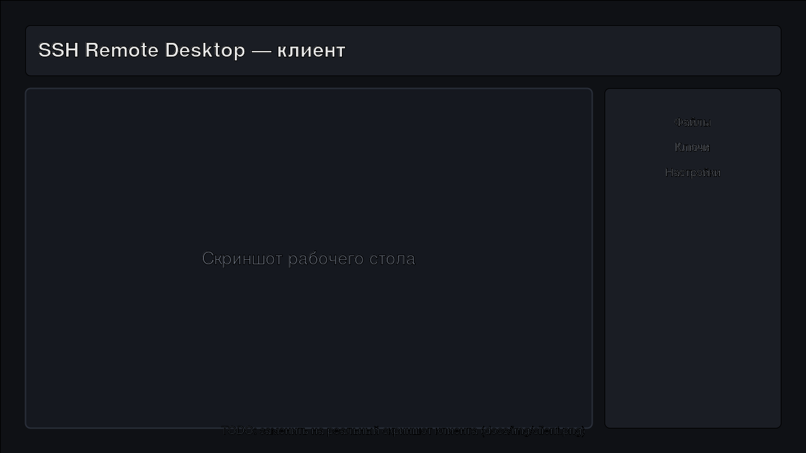
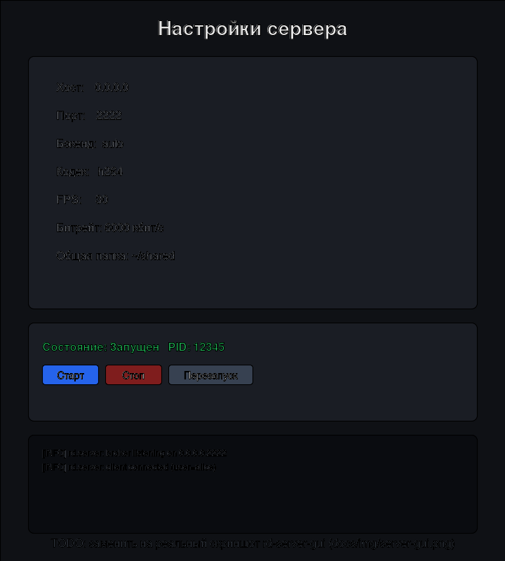
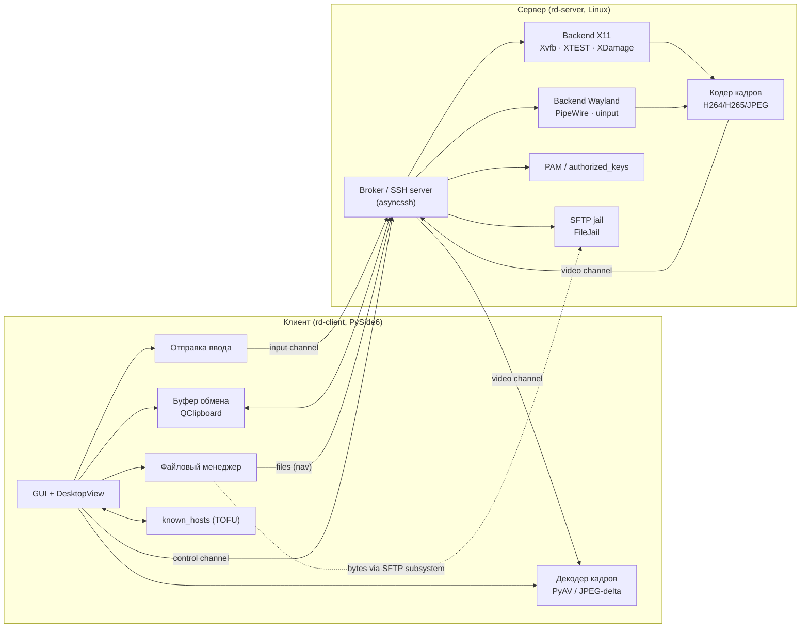

<div align="center">

# SSH Remote Desktop

**Удалённый рабочий стол поверх SSH — для тех, кому нужен графический доступ к Linux-машине без VNC, RDP и открытых лишних портов.**

[](https://github.com/hirokyserega-web/ssh-remote-desktop/actions/workflows/ci.yml)
[](https://github.com/hirokyserega-web/ssh-remote-desktop/actions/workflows/release.yml)
[](https://github.com/hirokyserega-web/ssh-remote-desktop/releases)
[](LICENSE)
[](https://www.python.org/)
[](#поддержка-платформ)

**RU** · [**EN**](README.en.md)

</div>

---




> Скриншоты выше — плейсхолдеры в `docs/img/`. Замените `client.png` и `server-gui.png` на реальные снимки `rd-client` и `rd-server-gui` (см. `docs/img/README.md`).

---

## Ключевые возможности

- 🔐 **Только SSH-транспорт.** Никаких VNC/RDP/открытых графических портов — всё мультиплексируется по одному SSH-соединению (каналы `control` / `video` / `input` / `clipboard` / `files`).
- 🖥️ **Сервер на X11 и Wayland.** X11 — через Xvfb + XTEST + XDamage + XFixes. Wayland — через PipeWire + `xdg-desktop-portal` + wlr-протоколы + `uinput` (захват экрана под Wayland — экспериментальный, см. [платформы](#поддержка-платформ)).
- 🎞️ **Кодеки `h264` / `h265` / `jpeg`.** H.264/H.265 — через PyAV (ffmpeg), JPEG — через Pillow с дельта-кодированием по «грязным» прямоугольникам. Авто-fallback на JPEG, если PyAV недоступен.
- 📁 **SFTP с jail.** Передача байтов — через штатный SFTP-subsystem asyncssh, но навигация ограничена общей папкой сессии (`FileJail` блокирует `..` и абсолютные пути).
- 📋 **Буфер обмена.** Двунаправленная синхронизация через `xclip`/`wl-clipboard` на сервере и `QClipboard` на клиенте. Лимит размера и отключение на сторону — в конфиге.
- 👥 **Мультисессии.** Несколько одновременных сессий на одном сервере, persistent-сессии для переподключения, idle-timeout, ограничение `max_sessions`.
- 🛠️ **Демон и systemd.** `rd-server --daemon/--stop/--status` (double-fork + setsid + pidfile) либо `--install-service` / `--uninstall-service` для systemd-юнита `ssh-remote-desktop.service`.
- 🎛️ **Графическая панель `rd-server-gui`.** Редактор `server.toml`, старт/стоп/рестарт сервера (через systemd или daemon-fallback), live-лог, трей, автозапуск при загрузке. Без хранения секретов.

## Содержание

- [Быстрый старт](#быстрый-старт)
- [Поддержка платформ](#поддержка-платформ)
- [Архитектура](#архитектура)
- [Установка (подробно)](#установка-подробно)
- [Запуск сервера](#запуск-сервера)
- [Запуск клиента](#запуск-клиента)
- [SSH-ключи](#ssh-ключи)
- [Буфер обмена](#буфер-обмена)
- [Файлы и SFTP](#файлы-и-sftp)
- [Мультисессии](#мультисессии)
- [Конфигурация](#конфигурация)
- [Сборка исполняемых файлов](#сборка-исполняемых-файлов)
- [Troubleshooting](#troubleshooting)
- [Безопасность](#безопасность)
- [Разработка и contributing](#разработка-и-contributing)
- [Лицензия](#лицензия)

## Быстрый старт

Установите клиент и сервер одной командой. По умолчанию ставится готовый бинарь из последнего [GitHub Release](https://github.com/hirokyserega-web/ssh-remote-desktop/releases) (с проверкой SHA256); если ассета для вашей платформы нет — сборка из исходников.

**Linux — сервер** (нужен `sudo` для PAM, Xvfb и `/dev/uinput`):

```bash
curl -fsSL https://raw.githubusercontent.com/hirokyserega-web/ssh-remote-desktop/main/scripts/install-server-linux.sh | sudo bash
```

Установит демон `rd-server` и графическую панель `rd-server-gui` (появится в меню приложений как «SSH Remote Desktop — Server Panel»), проверит SHA256, создаст симлинки в `~/.local/bin`.

**Linux — клиент:**

```bash
curl -fsSL https://raw.githubusercontent.com/hirokyserega-web/ssh-remote-desktop/main/scripts/install-client-linux.sh | bash
```

**Windows — клиент** (PowerShell 5.1+):

```powershell
iwr -useb https://raw.githubusercontent.com/hirokyserega-web/ssh-remote-desktop/main/scripts/install-client-windows.ps1 | iex
```

**Первый запуск (3 шага):**

```bash
# 1. На сервере: сгенерируйте SSH-ключ клиента (или используйте существующий ~/.ssh/id_ed25519)
rd-client --keygen                # на клиентской машине

# 2. Добавьте публичный ключ клиента в authorized_keys пользователя на сервере
#    (вставьте ~/.config/ssh-remote-desktop/id_ed25519.pub в
#     server_user@server:~/.ssh/authorized_keys)

# 3. Подключитесь
rd-client --host YOUR-SERVER --user YOUR-USER --key-path ~/.ssh/id_ed25519
```

> Бинари ставятся в `~/.local/share/ssh-remote-desktop/bin` и ссылаются из `~/.local/bin`. Если `~/.local/bin` нет в `PATH`, откройте новый шелл или выполните `export PATH="$HOME/.local/bin:$PATH"`.

## Поддержка платформ

| Компонент | Linux X11 | Linux Wayland | Windows | macOS |
|---|:---:|:---:|:---:|:---:|
| **Сервер** (захват экрана + ввод) | ✅ Полностью (Xvfb + XTEST + XDamage) | ⚠️ Экспериментально (PipeWire + портал; placeholder-кадр, если портал недоступен) | ❌ | ❌ |
| **Клиент** (GUI + декодер) | ✅ (`xcb`) | ✅ (`wayland;xcb` с fallback на XWayland) | ✅ | ⚠️ Сборка из исходников, без готового release-ассета |

Бэкенд сервера выбирается ключом `backend = "auto" | "x11" | "wayland"` (по умолчанию `auto`: X11 при наличии `DISPLAY`, иначе Wayland).

## Архитектура



**Один SSH-канал, пять логических каналов.** Транспорт asyncssh даёт один байтовый поток; поверх него `common/framing.py` запускает мини-мультиплексор: каждый кадр помечен `Channel` (`control` / `video` / `input` / `clipboard` / `files`) в фиксированном 6-байтовом заголовке (`common/protocol.py`). Сообщения контрольного плана сериализуются MessagePack, если доступен, иначе JSON (`common/messages.py`).

**Файлы — гибрид.** Байты файлов идут через штатный SFTP-subsystem asyncssh (отдельный канал SSH), а канал `files` в нашем мультиплексоре несёт только команды навигации/статуса. `FileJail` (`server/files.py`) ограничивает все пути рамками общей папки сессии.

<details>
<summary><strong>Структура репозитория</strong></summary>

```
client/            GUI-клиент (PySide6): main_window, desktop_view, transport, decoder, dialogs
common/            Общий код обеих сторон
  protocol.py      PROTO_VERSION, Channel, Flags, формат фрейма
  framing.py       Кодек фреймов + асинхронный мультиплексор
  messages.py      Сериализация control/input/clipboard сообщений (JSON/MessagePack)
  config.py        ServerConfig / ClientConfig, загрузка TOML/JSON
server/            SSH-сервер
  broker.py        Broker: приём соединений, SFTP-factory, диспетчеризация
  connection.py    Обработка одной SSH-сессии
  daemon.py        Двойной fork, pidfile, --stop/--status
  encoder.py       H264/H265/JPEG кодеры
  backend/         base.py · x11.py · wayland.py · wayland_pipewire.py
  files.py         FileJail (SFTP-jail)
  auth.py          PAM / authorized_keys
server_gui/        rd-server-gui: PySide6-панель управления сервером
  controller.py    Тестируемая логика без Qt (ConfigController, ServiceController)
  __main__.py      GUI-окно + трей
crypto/            keygen.py — генерация ed25519-ключей
scripts/           install.sh · install.ps1 · install-{client,server}-linux.sh · install-client-windows.ps1 · release.sh
packaging/systemd/ ssh-remote-desktop.service — шаблон юнита
tests/             pytest + pytest-asyncio
build_*.sh         Сборка standalone-бинарей через Nuitka
```

</details>

## Установка (подробно)

<details>
<summary><strong>Универсальный установщик <code>scripts/install.sh</code></strong></summary>

По умолчанию ставит готовый бинарь из последнего релиза (с проверкой SHA256 из `SHA256SUMS`). Если ассета для вашей платформы нет — собирает из исходников.

```bash
curl -fsSL https://raw.githubusercontent.com/hirokyserega-web/ssh-remote-desktop/main/scripts/install.sh | bash
```

**Флаги:**

| Флаг | Описание |
|---|---|
| `--run` | Установка стабильного релиза (по умолчанию) |
| `--dev` | Git clone + editable `pip install -e .` |
| `--both` | Dev checkout + сборка бинаря |
| `--build` | Форсировать сборку через Nuitka |
| `--no-build` | Пропустить сборку бинарей |
| `--from-source` | Всегда из исходников, игнорировать релизы |
| `--version X.Y.Z` | Конкретный релиз |
| `--component client\|server\|both` | Что ставить (по умолчанию: `both` на Linux, `client` на остальных). `server` на Linux ставит демон `rd-server` и панель `rd-server-gui`; можно явно указать `server-gui` для одной панели |
| `--dir PATH` | Директория установки |
| `--python BIN` | Конкретный интерпретатор |
| `--uninstall` | Полностью удалить (бинарь, venv, симлинки, пустой конфиг) |
| `-h, --help` | Справка |

**Переменная окружения:** `SSH_REMOTE_DESKTOP_DIR` — директория установки (по умолчанию `~/.local/share/ssh-remote-desktop`; для серверного wrapper-скрипта — `/opt/ssh-remote-desktop`).

</details>

<details>
<summary><strong>Установка вручную через pip extras</strong></summary>

```bash
git clone https://github.com/hirokyserega-web/ssh-remote-desktop.git
cd ssh-remote-desktop
python -m venv .venv && source .venv/bin/activate
pip install -e .
```

**Extras** (из `pyproject.toml`):

```bash
# Клиент на любой ОС
pip install "ssh-remote-desktop[client]"

# Сервер на Linux (X11)
pip install "ssh-remote-desktop[server,server-x11]"

# Сервер на Linux (Wayland)
pip install "ssh-remote-desktop[server,server-wayland]"

# Графическая панель сервера
pip install "ssh-remote-desktop[server-gui]"

# H.264/H.265 — нужен PyAV (ffmpeg)
pip install "ssh-remote-desktop[h264]"

# JPEG-only — достаточно Pillow
pip install "ssh-remote-desktop[jpeg]"

# Всё для Linux-хоста с клиентом и сервером
pip install "ssh-remote-desktop[linux-full]"

# Разработка: pytest + pytest-asyncio + ruff
pip install "ssh-remote-desktop[dev]"
```

**Системные пакеты Linux** ставятся `install.sh` автоматически. Для ручной установки см. комментарии в `scripts/install.sh` (раздел `install_system_deps`): для Debian/Ubuntu это `xvfb xauth xclip ffmpeg qt6-wayland libxcb-* libdbus-1-3 openssh-server` и т.д.

</details>

## Запуск сервера

<details>
<summary><strong>Передний план (по умолчанию, также под systemd)</strong></summary>

```bash
rd-server --config /etc/ssh-remote-desktop/server.toml
# или с переопределениями из CLI
rd-server --host 0.0.0.0 --port 2222 --backend auto --codec h264 --max-sessions 10
```

SIGTERM/SIGINT вызывают чистый `Broker.shutdown()`. PID-file по умолчанию: `/run/ssh-remote-desktop.pid` (под root) или `~/.config/ssh-remote-desktop/rd-server.pid` (под пользователем); переопределяется через `--pidfile`.

</details>

<details>
<summary><strong>Демон (<code>--daemon</code> / <code>--stop</code> / <code>--status</code>)</strong></summary>

```bash
# Запустить в фоне (double-fork + setsid; stdio → --log-file или /dev/null)
rd-server --daemon --config /etc/ssh-remote-desktop/server.toml --log-file /var/log/rd-server.log

# Проверить состояние
rd-server --status
# → running | stopped, pid, port, host

# Остановить (SIGTERM по pidfile)
rd-server --stop
```

Демон не стартует, если в pidfile уже записан живой PID — сначала `--stop`. Реализовано в `server/daemon.py`.

</details>

<details>
<summary><strong>systemd-юнит</strong></summary>

Шаблон юнита: `packaging/systemd/ssh-remote-desktop.service` (`Type=simple`, `User=root`, `Restart=on-failure`). Команды `rd-server` сами рендерят юнит с реальным путём к бинарю, кладут его в `/etc/systemd/system/`, делают `daemon-reload` и `enable --now`:

```bash
# Установить и включить автозапуск
sudo rd-server --install-service --config /etc/ssh-remote-desktop/server.toml

# Только включить/выключить автозапуск уже установленного юнита
sudo rd-server --enable-service
sudo rd-server --disable-service

# Полностью удалить: stop + disable + rm юнита + daemon-reload
sudo rd-server --uninstall-service
```

После установки сервис управляется стандартно:

```bash
sudo systemctl status ssh-remote-desktop.service
sudo journalctl -u ssh-remote-desktop.service -f
```

</details>

<details>
<summary><strong>Графическая панель <code>rd-server-gui</code></strong></summary>

```bash
rd-server-gui                              # открыть окно с дефолтным config-путём
rd-server-gui --config /etc/ssh-remote-desktop/server.toml
rd-server-gui --tray                       # включить значок в трее (по умолчанию)
rd-server-gui --no-tray                    # без трея
rd-server-gui --minimized                  # стартовать свёрнутой в трей
```

Панель (`server_gui/`) позволяет:

- редактировать `server.toml` (host/port/backend/limits/codec/auth-тогглы/`run_as_user`/логирование) с валидацией и атомарным сохранением;
- старт/стоп/рестарт сервера — через systemd, если юнит установлен, иначе через `rd-server --daemon/--stop`;
- смотреть live-статус (running/stopped, PID, port) и хвост лога (journald для systemd, `--log-file` для демона);
- тогглить «Автозапуск при загрузке» (только для systemd);
- сворачиваться в трей с пунктом «Свернуть в трей при закрытии».

Конфиг-контроллер вынесен в `server_gui/controller.py` и тестируется без Qt. Секреты в конфиг не пишутся.

</details>

<details>
<summary><strong>Под X11 (Xvfb)</strong></summary>

Бэкенд `x11` (`server/backend/x11.py`) использует `Xvfb` для headless-дисплея, XTEST — для ввода, XDamage + XFixes — для инкрементального захвата. Параметры в `server.toml`:

```toml
backend = "x11"
xvfb_bin = "Xvfb"               # путь к бинарнику Xvfb
window_manager = ""             # опционально: команда WM/DE на сессию
session_geometry = [1920, 1080]
session_depth = 24
```

</details>

<details>
<summary><strong>Под Wayland (headless-композитор)</strong></summary>

Бэкенд `wayland` (`server/backend/wayland.py` + `wayland_pipewire.py`) использует `xdg-desktop-portal` + PipeWire для ScreenCast и `uinput`/`ydotool` для ввода. Если портал/демон недоступны — `capture()` возвращает **placeholder-кадр**, а ввод и буфер обмена продолжают работать. Это сознательный graceful-degradation, не боевое решение для продакшна.

```toml
backend = "wayland"
wayland_compositor = "sway"     # sway | weston | kwin | gnome
use_uinput = true               # эмуляция ввода через /dev/uinput
```

</details>

## Запуск сервера: привилегии (root vs пользователь)

Сервер может работать в двух режимах привилегий, и выбор определяется тем, **какие функции аутентификации включены**:

| Функция | Требует | Почему |
|---|---|---|
| `allow_password=true` (PAM) | **root** или группа `shadow` | `python-pam` читает `/etc/shadow` |
| `run_as_user=true` (drop-privileges) | **root** | сессии понижают привилегии через `setuid` |
| только `allow_publickey=true` | обычный пользователь | достаточно прав на `~/.ssh/authorized_keys` |

**По умолчанию** `allow_password=true` и `run_as_user=true` — поэтому серверу нужен root. При старте без root и включённых пароле/`run_as_user` сервер печатает предупреждение (лог + панель `rd-server-gui`), а не падает, но **все входы по паролю будут молча отвергнуты**, а сессии не смогут понизить привилегии — это выглядит как «сервер не работает».

### Рекомендованные варианты запуска

**1. systemd-юнит (рекомендуется для сервера):**
```bash
sudo rd-server --install-service --config /etc/ssh-remote-desktop/server.toml
# юнит стартует под User=root: PAM и setuid доступны, логи — в journald
```
Панель `rd-server-gui` в systemd-режиме выполняет `Старт`/`Стоп` через `pkexec`/`sudo systemctl`, если сама запущена не от root.

**2. Запуск вручную под root:**
```bash
sudo rd-server --foreground --config /etc/ssh-remote-desktop/server.toml
# или демон:
sudo rd-server --daemon --log-file /var/log/rd-server.log
```

**3. Только парольная аутентификация без root** — добавьте пользователя в группу `shadow`:
```bash
sudo usermod -aG shadow "$USER"
# затем (после перелогина) rd-server может проверять пароли через PAM
```

**4. Безпарольный сервер (публичные ключи)** — отключите пароль и drop-privileges:
```toml
# server.toml
allow_password = false
run_as_user = false
```
Так сервер стартует обычным пользователем без повышения привилегий; аутентификация — только по публичному ключу из `~/.ssh/authorized_keys`.

> **Демон под Nuitka onefile.** Пребилт-бинарь `rd-server` собран как Nuitka onefile. Внутри замороженного бинаря классический double-fork (`--daemon`) небезопасен: родительский процесс сносит распаковку onefile, и демон-внук погибает молча (stdio уже перенаправлен). Поэтому в замороженном бинаре `--daemon` реализован через перезапуск самого себя в foreground как отслеживаемого фонового процесса (`start_new_session=True`, stdout/stderr → лог-файл), а pidfile пишет дочерний процесс. Графическая панель в демон-режиме делает то же самое: запускает `rd-server --foreground` через `Popen` и показывает stderr дочернего при неудаче. При запуске из исходников/venv (не заморожено) используется обычный double-fork.

## Запуск клиента

<details>
<summary><strong>CLI и подключение</strong></summary>

```bash
rd-client --host YOUR-SERVER --user YOUR-USER --key-path ~/.ssh/id_ed25519
rd-client --config ~/.config/ssh-remote-desktop/client.toml
rd-client --keygen                                # только генерация ключа, без запуска GUI
```

**Флаги** (`client/__main__.py`):

| Флаг | Описание |
|---|---|
| `--config PATH` | Путь к `client.toml` |
| `--host`, `--port`, `--user` | Параметры подключения |
| `--auth {key,password,agent}` | Способ аутентификации |
| `--key-path PATH` | Путь к приватному ключу |
| `--codec {h264,h265,jpeg}` | Кодек видео |
| `--qt-platform {auto,xcb,wayland}` | Принудительный Qt-плагин (Linux) |
| `--fullscreen` | Стартовать на весь экран |
| `--no-clipboard` | Отключить синхронизацию буфера обмена |
| `--keygen` | Только открыть генератор SSH-ключей и выйти |
| `--log-level` | Уровень логирования |

Под Linux `QT_QPA_PLATFORM` выбирается автоматически: при наличии `WAYLAND_DISPLAY` — `wayland;xcb` (с fallback на XWayland), иначе `xcb`. HiDPI-скейлинг включён по умолчанию.

</details>

<details>
<summary><strong>На Windows / Linux X11 / Linux Wayland</strong></summary>

- **Windows:** установка — `install-client-windows.ps1` (см. [Быстрый старт](#быстрый-старт)). После — `rd-client` в новом шелле, либо `rd-client --keygen` для генерации ключа.
- **Linux X11:** `rd-client` запускается с `QT_QPA_PLATFORM=xcb`.
- **Linux Wayland:** `QT_QPA_PLATFORM=wayland;xcb` (нативный Wayland с fallback на XWayland, если Qt-плагин `wayland` отсутствует в сборке). Обнаружение Wayland многосигнальное: `WAYLAND_DISPLAY` → `XDG_SESSION_TYPE=wayland` → сокет `wayland-N` в `XDG_RUNTIME_DIR`, а `XDG_RUNTIME_DIR` восстанавливается из `/run/user/<uid>`, если его нет в окружении.
- **Запуск из меню приложений (Wayland):** `.desktop`-ярлыки запускают бинарник через обёртку `rd-launch`, которая восстанавливает session-переменные (`WAYLAND_DISPLAY`, `XDG_RUNTIME_DIR`), отсутствующие в окружении D-Bus/`systemd --user`-активации — иначе на Hyprland/Sway/river/несистемном GNOME клик по ярлыку молча ничего не открывает.
- **Если клиент всё же не открывается:** детали краша пишутся в `~/.config/ssh-remote-desktop/client-launch.log` (Qt-платформа, переменные окружения, traceback) — приложите его к issue. При возможности показывается диалог с путём к логу.

</details>

## SSH-ключи

<details>
<summary><strong>Генерация и распространение</strong></summary>

```bash
# В клиенте: Help → SSH keys (или флаг --keygen)
rd-client --keygen
# Создаст ed25519-ключ в ~/.config/ssh-remote-desktop/id_ed25519
```

Публичный ключ (`id_ed25519.pub`) нужно добавить в `~/.ssh/authorized_keys` пользователя на сервере. Сервер использует системные аккаунты и PAM (`server/auth.py`), отдельных пользователей не создаёт.

Конфиг клиента по умолчанию:

```toml
auth = "key"
key_path = "~/.config/ssh-remote-desktop/id_ed25519"
known_hosts = "~/.config/ssh-remote-desktop/known_hosts"
accept_unknown_host = false     # false → TOFU-промпт в UI
```

`auth` также может быть `"password"` или `"agent"` (использовать ssh-agent).

</details>

## Буфер обмена

<details>
<summary><strong>Двунаправленная синхронизация</strong></summary>

- **Сервер:** `xclip` под X11, `wl-clipboard` под Wayland.
- **Клиент:** `QClipboard` из PySide6.
- Передаётся по каналу `clipboard` нашего мультиплекса.

Тогглы и лимиты — в конфигах:

```toml
# server.toml
clipboard_enabled = true
clipboard_max_bytes = 1048576     # 1 MiB

# client.toml
clipboard_enabled = true
clipboard_max_bytes = 1048576
```

Клиент: флаг `--no-clipboard` на один запуск. Сервер: `--no-clipboard`.

</details>

## Файлы и SFTP

<details>
<summary><strong>SFTP-jail и общая папка</strong></summary>

Передача байтов — через штатный SFTP-subsystem asyncssh, но `FileJail` (`server/files.py`) ограничивает все пути рамками **общей папки сессии**. Абсолютные пути и `..`-траверсал отклоняются; клиент никогда не видит файловую систему сервера за пределами этой папки. Канал `files` в нашем мультиплексоре несёт только команды навигации/статуса.

```toml
# server.toml
files_enabled = true
shared_dir = "~/shared"           # относительно HOME каждого пользователя
sftp_chunk_size = 262144          # 256 KiB

# client.toml
files_enabled = true
local_shared_dir = "~/ssh-remote-desktop-shared"
```

В GUI-клиенте файловый менеджер открывается из тулбара. Сервер: `--no-files` на один запуск.

</details>

## Мультисессии

<details>
<summary><strong>Модель сессий</strong></summary>

```toml
# server.toml
max_sessions = 10                 # лимит одновременных сессий
idle_timeout = 600                # секунды; 0 отключает
persistent_default = false        # keep-alive сессий для переподключения
session_geometry = [1920, 1080]
session_depth = 24
```

```toml
# client.toml
new_session = true                # запрашивать новую сессию
persistent = false                # переподключаться к существующей persistent-сессии
auto_reconnect = true
reconnect_delay = 2.0
max_reconnect_attempts = 0        # 0 = бесконечно
```

`run_as_user = true` (по умолчанию) — сервер понижает привилегии до подключающегося пользователя после аутентификации.

</details>

## Конфигурация

<details>
<summary><strong>Пути поиска конфигов</strong></summary>

Конфигурация layered: дефолты ← файл (TOML/JSON) ← аргументы CLI.

**Сервер** (`load_server_config`), первый найденный:

1. `RD_SERVER_CONFIG` (env)
2. `./server.toml`
3. `~/.config/ssh-remote-desktop/server.toml`
4. `/etc/ssh-remote-desktop/server.toml`

**Клиент** (`load_client_config`):

1. `RD_CLIENT_CONFIG` (env)
2. `./client.toml`
3. `~/.config/ssh-remote-desktop/client.toml`

</details>

<details>
<summary><strong>Полный <code>server.toml</code> с дефолтами</strong></summary>

```toml
# Сеть
host = "0.0.0.0"
port = 2222

# SSH host key сервера (генерируется при первом запуске, если отсутствует)
host_key = "~/.config/ssh-remote-desktop/host_ed25519"

# Бэкенд: "auto" | "x11" | "wayland"
backend = "auto"

# Сессии
max_sessions = 10
idle_timeout = 600                # секунды; 0 отключает
persistent_default = false
session_geometry = [1920, 1080]
session_depth = 24

# Кодирование
codec = "h264"                    # h264 | h265 | jpeg (fallback на jpeg, если PyAV недоступен)
fps = 30
bitrate_kbps = 6000
jpeg_quality = 80
cursor_mode = "embedded"          # "embedded" | "metadata"

# X11
xvfb_bin = "Xvfb"
window_manager = ""               # опциональная команда WM/DE на сессию

# Wayland
wayland_compositor = "sway"       # sway | weston | kwin | gnome
use_uinput = true

# Буфер обмена
clipboard_enabled = true
clipboard_max_bytes = 1048576     # 1 MiB

# Файлы / SFTP jail
files_enabled = true
shared_dir = "~/shared"           # относительно HOME каждого пользователя
sftp_chunk_size = 262144          # 256 KiB

# Аутентификация
allow_password = true
allow_publickey = true
run_as_user = true                # понижать привилегии до подключающегося пользователя

# Логирование
log_level = "INFO"
log_file = ""
```

</details>

<details>
<summary><strong>Полный <code>client.toml</code> с дефолтами</strong></summary>

```toml
host = ""
port = 2222
user = ""

# Аутентификация: "key" | "password" | "agent"
auth = "key"
key_path = "~/.config/ssh-remote-desktop/id_ed25519"
known_hosts = "~/.config/ssh-remote-desktop/known_hosts"
accept_unknown_host = false       # false → TOFU-промпт в UI

# Запрос сессии
new_session = true
persistent = false
geometry = [1920, 1080]
codec = "h264"                    # h264 | h265 | jpeg

# Отображение
qt_platform = "auto"              # auto | xcb | wayland (задаёт QT_QPA_PLATFORM)
start_fullscreen = false
scale_to_window = true
hidpi = true

# Буфер обмена / файлы (приватность)
clipboard_enabled = true
clipboard_max_bytes = 1048576
files_enabled = true
local_shared_dir = "~/ssh-remote-desktop-shared"

# Переподключение
auto_reconnect = true
reconnect_delay = 2.0
max_reconnect_attempts = 0        # 0 = бесконечно

# UI
theme = "system"                  # "light" | "dark" | "system"
language = "ru"                   # "ru" | "en"
jpeg_quality = 80                 # дефолтное JPEG-качество для диалога подключения

log_level = "INFO"
```

</details>

## Сборка исполняемых файлов

<details>
<summary><strong>Nuitka — standalone-бинари</strong></summary>

Релизный workflow `.github/workflows/release.yml` на каждый тег `v*` собирает standalone-бинари через Nuitka и публикует GitHub Release с `SHA256SUMS`. Скрипты в корне репо:

```bash
bash build_client_linux.sh        # → dist/rd-client
bash build_server_linux.sh        # → dist/rd-server
bash build_client_windows.sh      # → dist/rd-client.exe (под Windows)
bash build_client_macos.sh        # → dist/rd-client (под macOS, опционально)
```

Локально через `install.sh`:

```bash
curl -fsSL https://raw.githubusercontent.com/hirokyserega-web/ssh-remote-desktop/main/scripts/install.sh | bash -s -- --build
```

Имена release-ассетов: `ssh-remote-desktop-{client,server}-{linux,windows,macos}-{arch}.{tar.gz,zip}`.

Кат релиза — `scripts/release.sh` (`--dry-run`, `--no-push`).

</details>

## Troubleshooting

<details>
<summary><strong>Частые проблемы</strong></summary>

- **«rd-server already running (pid N)»** при `--daemon`: живой pidfile. Выполните `rd-server --stop`, затем запускайте снова.
- **Под Wayland клиенту показывается placeholder-кадр:** портал `xdg-desktop-portal` (и соответствующий backend — `-wlr`/`-gnome`/`-kde`) не запущен. Запустите его и `pipewire`; проверьте логи сервера (`rd-server --status`, `journalctl -u ssh-remote-desktop.service`).
- **«H.264 encoder init failed; falling back to JPEG»:** PyAV не установлен или ffmpeg без `libx264`. `pip install "ssh-remote-desktop[h264]"` и системный `ffmpeg`.
- **`Permission denied (publickey)`:** публичный ключ клиента не в `~/.ssh/authorized_keys` пользователя на сервере, либо `allow_publickey = false` в `server.toml`.
- **PAM-аутентификация не работает:** во-первых, должен быть установлен `python-pam` (`pip install python-pam>=2.0.2`; включён в `requirements-linux.txt` и в пребилт-бинарь `rd-server`). Во-вторых, PAM читает `/etc/shadow`, поэтому сервер должен запускаться под **root** (или через systemd-юнит с `User=root`) — либо добавьте запускающего пользователя в группу `shadow`: `sudo usermod -aG shadow $USER`. При `allow_password = true` и отсутствии PAM сервер при старте пишет в лог явное ERROR — проверьте `journalctl -u ssh-remote-desktop.service`.
- **`~/.local/bin` не в PATH:** `export PATH="$HOME/.local/bin:$PATH"` или откройте новый шелл.
- **Полное удаление:** `curl -fsSL .../install.sh | bash -s -- --uninstall` (удаляет бинарь, venv, симлинки, пустой конфиг — но НЕ трогает ваши ключи и `known_hosts`).

</details>

## Безопасность

- **TOFU known_hosts.** При `accept_unknown_host = false` (дефолт клиента) первое подключение к неизвестному хосту показывает промпт в GUI с отпечатком ключа; принятый ключ записывается в `known_hosts` и проверяется при последующих подключениях.
- **Аутентификация через системные аккаунты / PAM.** Сервер не заводит отдельных пользователей — используются системные аккаунты и PAM (`server/auth.py`). Для PAM сервер запускается под root и понижает привилегии через `run_as_user`.
- **SFTP-jail.** Все файловые операции ограничены общей папкой сессии (`FileJail`); выход за её пределы через абсолютные пути или `..` отклоняется.
- **Secret-free GUI.** `rd-server-gui` хранит только публичные настройки (host/port/backend/limits/кодек/тогглы), никогда не пишет секреты в `server.toml`. SSH-ключи остаются в `~/.config/ssh-remote-desktop/` и `~/.ssh/`.
- **Смена порта по умолчанию.** Дефолт `port = 2222` (не 22). Сменить: `port = ...` в `server.toml` или `--port N` в CLI (одинаково для клиента и сервера).
- **Отключаемые поверхности.** Буфер обмена и файлы можно отключить на любую сторону (`clipboard_enabled`, `files_enabled`, `--no-clipboard`, `--no-files`) — для минимизации поверхности атаки.

Подробности — в `SECURITY.md`.

## Разработка и contributing

<details>
<summary><strong>Dev-окружение и проверки</strong></summary>

```bash
git clone https://github.com/hirokyserega-web/ssh-remote-desktop.git
cd ssh-remote-desktop
python -m venv .venv && source .venv/bin/activate
pip install -e ".[dev,linux-full]"

# Линт
ruff check .

# Тесты (pytest + pytest-asyncio)
pytest                  # все тесты
pytest tests/test_daemon.py    # конкретный модуль
```

CI (`.github/workflows/ci.yml`) прогоняет: Lint (ruff + compile), Installer scripts (`bash -n` + shellcheck), Workflow lint (actionlint), Tests (Linux, Python matrix), Tests (Windows).

Структура репо и модулей — см. [выше](#архитектура).

</details>

См. также `CONTRIBUTING.md` и `AGENTS.md`. PR и issue — на GitHub.

## Лицензия

[MIT](LICENSE) © 2026 hirokyserega-web.

### Благодарности

- [asyncssh](https://www.asyncssh.org/) — SSH-транспорт и SFTP-subsystem.
- [PyAV](https://github.com/PyAV-Org/PyAV) / ffmpeg — H.264/H.265.
- [PySide6](https://www.qt.io/) / Qt6 — GUI клиента и панели сервера.
- [python-xlib](https://github.com/python-xlib/python-xlib), [mss](https://github.com/BoboTiG/python-mss) — X11-захват.
- [pywayland](https://github.com/flacjacket/pywayland), [evdev](https://python-evdev.org/) — Wayland-бэкенд.
